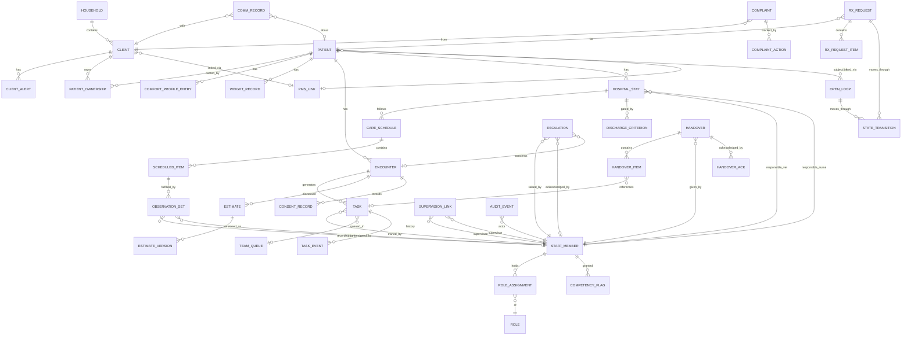

# Part 6 — Information Architecture

## 6.1 Primary navigation (shared shell)

**[REC]** Seven top-level items, not the brief's fifteen. Fifteen modules for 21 users guarantees emptiness and confusion; several brief modules (Payments, Documents, Reports, Communications) are *facets of records*, not destinations.

1. **Today** — role-aware home (the only screen most staff need most of the day)
2. **Patients** (client reached through patient and vice versa — one search)
3. **Hospital** — the whiteboard
4. **Tasks** — everything owed, by me / my team / everyone
5. **Prescriptions** — the repeat-Rx queue
6. **Handover** — shift handover build + acknowledge
7. **Admin** — config, users, audit, exports (Practice Director / Head roles only)

Consultations, procedures, diagnostics, comms, consent live *inside* patient/encounter context. Schedule stays in Merlin for MVP (deep-link out); it becomes a top-level item only with PMS integration.

## 6.2 Role-based navigation

Same shell, different Today: reception Today = waiting board + intake + callbacks; vet Today = consult list + open loops (results, unsigned, callbacks); nurse Today = assigned patients + due obs/meds + clinics; VCA Today = task board only (reduced chrome, big targets); director Today = exceptions. Users with multiple hats (common at 21 staff) switch views, not accounts.

## 6.3 Dashboard structure

Exception-first everywhere: a tile is (count breaching threshold) + (oldest age) + (one-tap drill to owning items). No vanity charts on operational screens; trends live in a weekly Admin view. Every number must be clickable to the underlying list — unactionable numbers erode trust.

## 6.4 Patient-record structure

Header (always visible): photo, name, species/breed chips, age, sex/neuter, weight + trend arrow, **alert chips** (allergy, handling, comfort profile, deceased), PHC badge, outstanding-task count.
Tabs: **Timeline** (default) · Care (obs, care plans, hospital stays) · Tasks & loops · Comms & consent · Details (microchip, insurance, comfort profile) · [Clinical — deep-link to Merlin until integration].

## 6.5 Client-record structure

Household with members and pets; contact + preferences + accessibility needs; factual safety alerts (dated, attributed, reviewable — never free-form labels [REC: "do not see alone — incident 2026-03-01, ref C-114" not "difficult client"]); account-balance chip (read-only from PMS when integrated); communication timeline; open items (what they're waiting for / what we're waiting for — 4.11's relationship view).

## 6.6 Timeline design

One reverse-chronological stream per patient of typed events (visit, obs set, task, call, escalation, document, status change), filterable by type; each event: icon, timestamp, actor, one-line summary, expand for detail; episode grouping (encounter bundles its events); AI-origin badge on any AI-drafted content [REG RCVS]. Deceased banner replaces header colour, timeline preserved.

## 6.7 Search design

One omnisearch (patients, clients, tasks): tolerant of "bella smith" (pet+surname — the desk reality), phone-number fragments, postcode; recents-first for the receptionist mid-call; keyboard-first (reception types while talking). Duplicate-suspect surfacing inline ("2 similar: merge?").

## 6.8 Task design

Task = owner (person or team-queue) + patient/client link (optional) + category + priority + due datetime + state (Open → In progress → Blocked → Done/Cancelled) + escalation route + evidence note on completion + full custody history. Team-queues must be claimable in one tap ("mine"). Recurring templates for care schedules. Overdue = visually loud, escalates per route, never silently deleted.

## 6.9 Notification design

Principles: (1) notifications mirror the task system — nothing exists only as a notification; (2) per-role channels: banner in-app; screen-flash for red-flag escalation; end-of-shift digest instead of drip for non-urgent; (3) escalation ladders: unacknowledged urgent → next person after N minutes (configurable per category); (4) no client-facing notifications from PLT in MVP (avoid double-messaging alongside Merlin/IVC comms).

## 6.10 Escalation design

Escalation is a first-class object: raiser, target (person→role fallback), reason code (4.2 list), severity, case link, acknowledgement (who/when), resolution note. SLA per severity (e.g. red-flag: 2 min ack). All escalations auditable and reportable (near-miss learning, complaints defence). "Escalate" never more than one tap from any patient context.

---

# Part 7 — Data Architecture

## 7.1 Source-of-truth rules (the constitution)

| Domain | Master | PLT holds |
|---|---|---|
| Client & patient demographics | **PMS (Merlin)** | Cached mirror + PLT-only extensions (comfort profile, alerts) keyed to PMS ID; until integration, a minimal local record flagged `unlinked` with a linking task |
| Appointments/diary | **PMS / My Vet Account** | Read-only mirror (integration) or manual day-list; waiting-state machine is PLT-owned |
| Clinical narrative, diagnosis, Rx, dispensing, invoicing | **PMS — always** | Nothing authoritative. Tasks may *reference* ("give meds per Merlin"), never restate doses as a second MAR (risk R3) |
| Tasks, handovers, escalations, boards, obs, checklists, comms log, complaints, timers | **PLT — sole master** | The defensible core |
| PHC membership | **IVC** | Read-only display + discrepancy tasks |
| Lab results | Lab/PMS | Loop states only (5.8) |
| Audit of coordination | **PLT** | Append-only |

Rule: **PLT never becomes second master of anything the PMS masters.** Any feature request violating this gets an integration prerequisite, not a workaround.

## 7.2 Core entities & relationships (ERD)

Notable fields:
- `PATIENT`: species (enum incl. rabbit/GP/ferret/hamster [FACT species seen]), breed, dob, sex, neuter status, microchip, photo, `deceased_at`, `deceased_suppression_done` (checklist state), insurance summary, PHC status (cached, source-labelled).
- `TASK`: category, priority, due_at, sla_policy_id, escalation_route, completion_evidence, custody history (TASK_EVENT append-only).
- `RX_REQUEST_ITEM`: free-text-as-submitted + matched-medication note + class flags (antimicrobial / CD schedule / cascade) + last-assessment date+type (human-entered until integration) [REG under-care gates].
- `ESTIMATE_VERSION`: amount, reason, communicated_at, communicated_by, client_response — the CMA evidence trail [REG].
- `CONSENT_RECORD`: type, version, limitations ("phone if >£X"), signature ref, withdrawal.
- `OBSERVATION_SET`: typed vitals + pain/stress scores, `draft_pending_countersign` for SVN [REG Schedule 3].
- `AUDIT_EVENT`: actor, action, entity, before/after, reason, `ai_involvement`, ip/device — append-only, exportable.

## 7.3 Data ownership & audit

- Every row: `created_by`, `created_at`; mutations append AUDIT_EVENT with before/after; clinical-adjacent content (obs, comfort entries, alerts) is **amend-by-supersede** — new version, old preserved and visible [REG Ch.13 discipline applied product-wide].
- Signing: obs and checklists "completed by X"; SVN drafts countersigned; nothing deletable by non-admins, and admin "deletion" = redaction flag with audit trail.
- View-access logging for client/patient records (who looked) — cheap in PLT, required for incident investigations and SAR completeness.

## 7.4 Retention

| Data | Retention [REC unless noted] |
|---|---|
| Anything referencing medicines context | ≥5 years [REG VMR floor] |
| Clinical-adjacent (obs, care records, escalations) | 7 years (limitation-period convention) |
| Tasks/handovers (non-clinical) | 3 years |
| Complaints | 6 years + CMA log duties [REG] |
| Audit events | Life of record + 1 year |
| Comms records | 7 years |
| Client data post-relationship | Review at 7 years; SAR/erasure honoured with clinical-record carve-outs (legal-obligation basis) |

## 7.5 Sensitive-data classification

- **Tier 1 — special category risk:** free-text capturing *client* health/bereavement/disability [REG Art. 9]. Mitigate by design: structured fields for accessibility needs with fixed vocabularies; free-text guidance ("record needs, not diagnoses"); periodic redaction review.
- **Tier 2 — high sensitivity:** client safety alerts, complaint content, staff supervision/competency data (employee data — visible to supervisee, HR-grade access).
- **Tier 3 — standard personal:** contact details, comms.
- **Tier 4 — operational:** patient clinical-adjacent data (sensitive via owner linkage, handled at Tier 3 controls).

## 7.6 Integration boundaries

Adapter interfaces defined now, implemented when access exists: `PmsAdapter` (clients, patients, diary, read; later write-back of notes/tasks) — target MWI VIP; `LabAdapter` (result-arrival events); `CommsAdapter` (email/SMS send + log); `OohAdapter` (report ingest). Each adapter: idempotent sync, source-precedence rules (PMS wins on conflict for mastered fields), sync-status surfaced in UI (never silently stale — show "as of 10:42").
